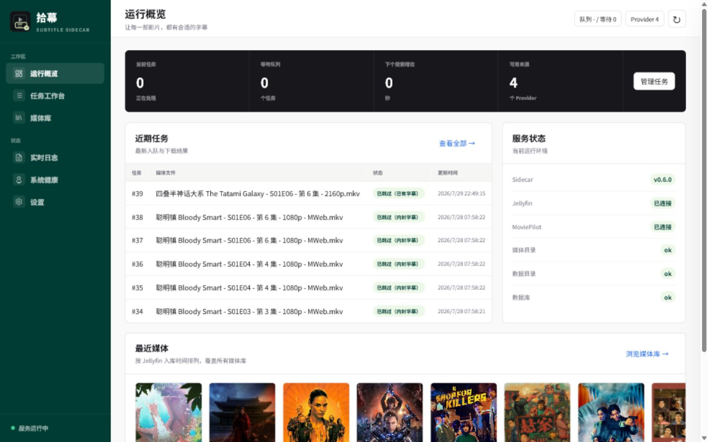

<p align="center">
  
</p>

<h1 align="center">拾幕 SubPick</h1>

<p align="center"><strong>让每一部影片，都有合适的字幕。</strong></p>

<p align="center">
  <a href="https://github.com/AlexTOOT/SubPick/releases">版本发布</a> ·
  <a href="https://github.com/AlexTOOT/SubPick/pkgs/container/subpick">Docker 镜像</a> ·
  <a href="docs/deployment/nas-docker.md">完整部署说明</a>
</p>

拾幕是面向 MoviePilot + Jellyfin 用户的轻量中文字幕服务，可作为
ChineseSubFinder 的替代方案。它接收 MoviePilot 入库通知，也可以浏览 Jellyfin
媒体库并手动创建字幕任务。影片身份统一读取 MoviePilot 生成的本地 NFO；Jellyfin
只负责媒体库浏览、海报、目录选择、字幕状态和下载后的刷新。

- 支持内嵌、外挂字幕检查及字幕对轴
- 支持电影、整剧、整季和单集批量操作
- 内置 Subliminal、ASSRT、SubDL、Zimuku 字幕来源
- 提供候选排查、任务重试、媒体库状态和系统日志
- 配置、数据库与缓存均自动保存在一个主目录中

> 当前版本仍处于早期阶段，建议先用少量媒体验证后再批量处理。

## 界面预览



## 快速部署

1. 在 NAS 上新建一个空目录，例如 `SubPick`。
2. 在 Docker 管理器中新建 Compose 项目，粘贴下面的内容。
3. 修改 `/volume1/SubPick` 和 `/volume1/media` 为 NAS 上的实际目录并启动。

```yaml
services:
  subpick:
    image: ghcr.io/alextoot/subpick:latest
    container_name: subpick
    networks:
      - subpick
    ports:
      - "19035:19035"
    volumes:
      - /volume1/SubPick:/appdata # 拾幕主目录
      # 媒体库根目录，应包含电影和剧集的全部媒体，推荐与 MoviePilot 的 /media 保持一致。
      - /volume1/media:/media
    environment:
      TZ: Asia/Shanghai
    restart: unless-stopped

  moviepilot-ocr:
    image: jxxghp/moviepilot-ocr:latest
    container_name: moviepilot-ocr
    networks:
      - subpick
    ports:
      - "9899:9899"
    restart: unless-stopped

networks:
  subpick:
    driver: bridge
```

也可以下载仓库中的 [compose.yaml](compose.yaml)。首次启动会在主目录内自动创建
`config.yaml`、`data` 和 `cache`，无需提前准备这些文件或目录。

打开 `http://<NAS-IP>:19035/`，按首次使用向导完成以下配置：

1. 填写 Jellyfin 地址和 API Key，并测试连接。
2. 启用需要的 Provider，填写对应凭据并检查可用性。
3. 将拾幕生成的 MoviePilot API Token 填入 ChineseSubFinder 插件。
4. 扫描 Jellyfin 媒体库，确认字幕状态。

ASSRT 会读取候选详情和下载统计以提高排序质量。由于官方 API 限速较低，启用后
一次搜索可能需要更长时间，这是质量优先的正常行为。

## MoviePilot 对接

继续使用 MoviePilot 的 ChineseSubFinder 插件：

- 服务地址：`http://<NAS-IP>:19035`
- API Key：与“拾幕 → 设置 → MoviePilot API Token”保持一致

推荐让 MoviePilot 和拾幕把同一个 NAS 媒体根目录映射为 `/media`。Jellyfin 的容器
路径无需完全相同；拾幕通过自己的 `/media` 读取媒体文件和 NFO，通过 Jellyfin 展示
媒体库并取得手动任务所选文件的目录。
如果 MoviePilot 下发的路径无法访问，运行概览会提示问题，可在“设置 → 系统与更新 →
目录映射”中测试并保存转换规则。

MoviePilot 回调可能早于 NFO 落盘。拾幕会等待 NFO 完成后再搜索字幕；电影优先使用
`movie.nfo`，剧集使用 `tvshow.nfo`，并结合有效分集 NFO 或文件名中的 `SxxExx`。

## Zimuku 与 OCR

上面的 Compose 会同时启动本地 MoviePilot OCR，拾幕默认通过
`http://moviepilot-ocr:9899` 使用它。启用 Zimuku 后，请在 Provider 设置中执行一次
OCR 实图检查。

## 更新与备份

更新镜像：

```bash
docker compose pull
docker compose up -d
```

配置、任务记录和缓存均位于映射到 `/appdata` 的主目录。备份时至少保留
`config.yaml` 和 `data`；`cache` 可按需重建。WebUI 也支持导入、导出运行配置。

## 更多文档

- [Docker / NAS 部署](docs/deployment/nas-docker.md)
- [字幕源搜索策略](docs/providers/search-strategy.md)
- [Zimuku 与本地 OCR](docs/providers/zimuku.md)
- [字幕校验与对轴流程](docs/workflows/subtitle-alignment.md)
- [Provider Adapter 接口](docs/provider-adapter-api.md)
- [发布与更新策略](docs/architecture/release-and-update-strategy.md)
- [路线图](ROADMAP.md)

## 许可证

拾幕使用 [GNU GPL v3 或更高版本](LICENSE) 发布。字幕内容及字幕站点服务受各自条款
约束，请仅下载和使用你有权访问的内容。

## 参考与致谢

拾幕的设计和实现参考或使用了以下项目与服务：

- 工作流与媒体库：[MoviePilot](https://github.com/jxxghp/MoviePilot)、[MoviePilot Plugins](https://github.com/jxxghp/MoviePilot-Plugins)、[Jellyfin](https://github.com/jellyfin/jellyfin)
- 项目经验：[ChineseSubFinder](https://github.com/ChineseSubFinder/ChineseSubFinder)、[Bazarr](https://github.com/morpheus65535/bazarr)
- 字幕与对轴组件：[Subliminal](https://github.com/Diaoul/subliminal)、[ffsubsync](https://github.com/smacke/ffsubsync)
- 媒体与压缩工具：[FFmpeg](https://github.com/FFmpeg/FFmpeg)、[MKVToolNix](https://gitlab.com/mbunkus/mkvtoolnix)、[7-Zip](https://github.com/ip7z/7zip)、[The Unarchiver](https://github.com/MacPaw/XADMaster)
- 验证码识别：[MoviePilot OCR](https://github.com/jxxghp/MoviePilot-OCR)
- 字幕服务：[ASSRT](https://assrt.net/)、[SubDL](https://subdl.com/)、[Zimuku](https://zimuku.org/)、[OpenSubtitles.com](https://www.opensubtitles.com/)
- 基础组件：[FastAPI](https://github.com/fastapi/fastapi)、[SQLAlchemy](https://github.com/sqlalchemy/sqlalchemy)、[HTTPX](https://github.com/encode/httpx)、[Beautiful Soup](https://www.crummy.com/software/BeautifulSoup/)、[Pillow](https://github.com/python-pillow/Pillow)

感谢这些项目的作者、维护者和字幕贡献者。
